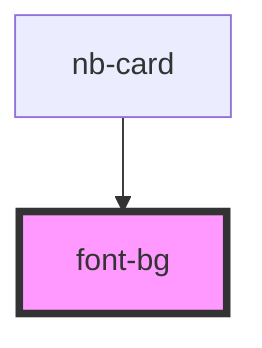

# font-bg

<!-- Auto Generated Below -->

## Properties

| Property      | Attribute   | Description | Type         | Default     |
| ------------- | ----------- | ----------- | ------------ | ----------- |
| `insertId`    | `insert-id` |             | `string`     | `undefined` |
| `styleConfig` | --          |             | `HanziStyle` | `undefined` |
| `type`        | `type`      | 1 米字格 2 田字格 | `number`     | `undefined` |

## Dependencies

### Used by

 - [nb-card](..)

### Graph

----------------------------------------------

*Built with [StencilJS](https://stenciljs.com/)*
