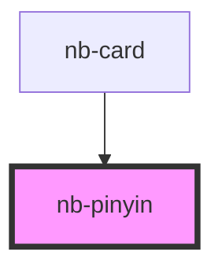

# nb-pinyin

<!-- Auto Generated Below -->

## Properties

| Property      | Attribute     | Description | Type          | Default     |
| ------------- | ------------- | ----------- | ------------- | ----------- |
| `mediaList`   | --            |             | `string[]`    | `[]`        |
| `pinyinList`  | `pinyin-list` |             | `any`         | `[]`        |
| `styleConfig` | --            |             | `PinyinStyle` | `undefined` |

## Dependencies

### Used by

 - [nb-card](..)

### Graph

----------------------------------------------

*Built with [StencilJS](https://stenciljs.com/)*
